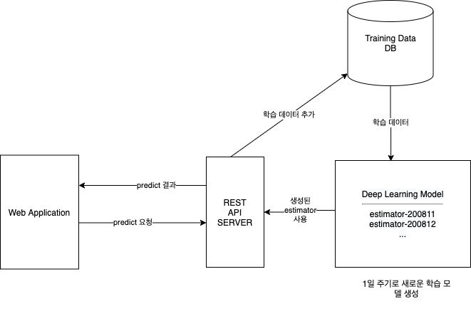
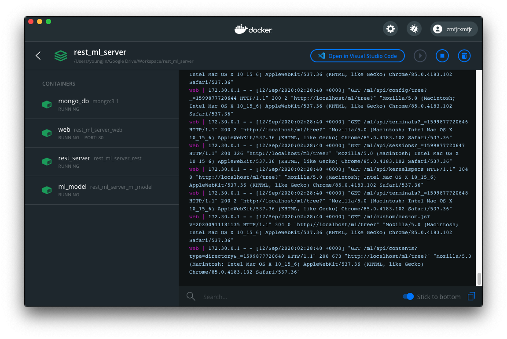
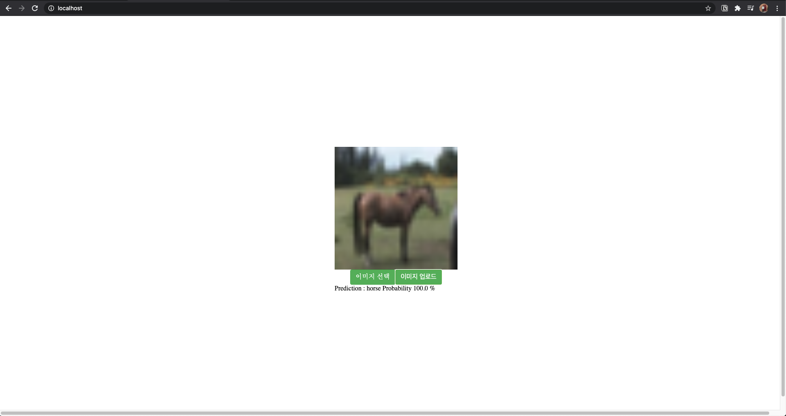

# ML Server Project

---

### 김영진 [https://github.com/angjin]

### 최규민 [https://github.com/gyumnnii]

주기적으로 학습하는 ML model과 prediction 결과를 web으로 제공하는 application 제작 프로젝트

## 구조



## requirements

docker  
docker-compose  
makefile

## 실행방법

```bash
make run
```



## 실행화면

### Web application

URL

> localhost



### ML Model 개발환경 ( jupyter notebook )

URL

> localhost/ml


default password : abc123

### DB

URL

> localhost/db

### REST API SERVER

URL

> localhost/rest


